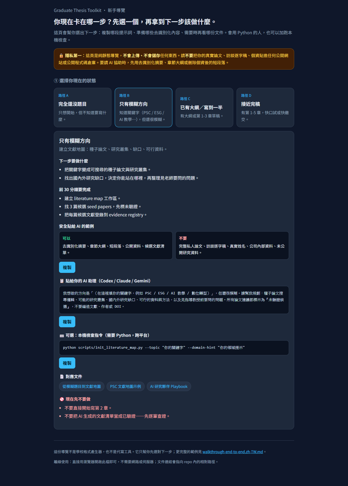
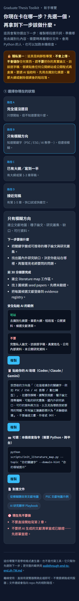

# Visual Proof

This page collects public-safe visual evidence for reviewers and new users. All screenshots use placeholder workflow content only.

## Static Onboarding Wizard

The onboarding page is a static guide layer for first-time students. It does not upload files, store content, call a backend, or depend on paid services.

Desktop view:



Mobile view:



The screenshots show the "vague direction" student path with:

- first-30-minute outcomes
- safe and unsafe examples for de-identified AI collaboration
- copyable agent prompt
- optional local command
- links to matching repository docs

## Public Demo Outputs

The public demo can be run locally:

```powershell
python scripts/run_demo.py
```

It produces:

- `literature/psc/first-30-minutes.md`
- `literature/psc/evidence-registry.csv`
- `literature/psc/ai-usage-log.md`
- `consistency/reports/citation_candidates.md`
- `consistency/reports/concept_hierarchy_report.md`
- `consistency/reports/promise_delivery_report.md`
- `deliverables/docx/thesis_render_v2_latest.docx`

The v0.1.8 release also includes a public placeholder DOCX artifact:

- [v0.1.8 Traceable Literature Intake](https://github.com/newqqo/grad-thesis-toolkit/releases/tag/v0.1.8)

## Verification

The latest local verification for v0.1.8:

- `python -m pytest -q`: 45 tests passed
- `python scripts/check_public_readiness.py`: passed
- `python scripts/check_agent_adapters.py`: passed
- `python scripts/run_demo.py`: passed
- onboarding browser smoke check: desktop and mobile screenshots captured; console clean after favicon fix

The repository also runs cross-platform GitHub Actions on Linux, macOS, and Windows.
